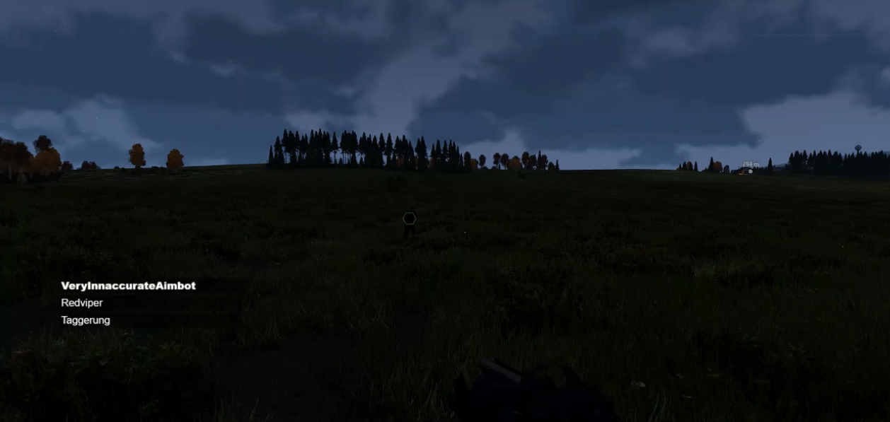

# TS3Voices
For making an OBS overlay showing teamspeak channel members and speakers.

A list of people in the channel is shown, with current speakers in bold.

This is currently a fairly basic project, and might have some bugs.
It is far enough along that it is usable, and ready for requests/feedback.

This plugin currently does not (currently) censor offensive names. It does use the nickname you set for a user if you set it, so you can prevent users changing names in the overlay list (right click the user in TS, edit in contacts, switch to friend, set custom nickname, Display->Only custom name). You could also use this to change their name to their twitch/youtube/mixer URL.

# Usage
[Download the plugin](https://github.com/bradon/TS3Voices/releases).

Enable the plugin.
Add http://localhost:8079 or http://127.0.0.1:8079 as a browser source in OBS.

Enjoy your stream!

This plugin currently requires obs and teamspeak to be on the same machine.
If you feel comfortable compiling yourself, just remove the binding to loopback to change this.
Otherwise, request I change this if you need it (or wait, it is on the to-do list!)

# Changing Styles
Feel free to make requests.
If you know some css or feel adventurous you can edit styles.css in the
teamspeak plugins folder/TS3Voices/html to change styles yourself

For creating your own themes please see /TS3Voices/html/themes/README.md

# Compiling Yourself
Clone this repo, and run get_libwebsockets.bat to set up the libwebsockets dependency.

Build with visual studio 2017. If you have 64bit 7-Zip you can use copy_to_plugin.bat to build the distributable plugin file.

Refer to a one of the released plugin files for the structure of the final plugin.

Ts3_plugin files are just zip files. Rename it to .zip, or use software like 7-zip to open it

# Credits
This plugin is based in part on the work of the libwebsockets project (https://libwebsockets.org)
as well as the teamspeak plugins sdk.
